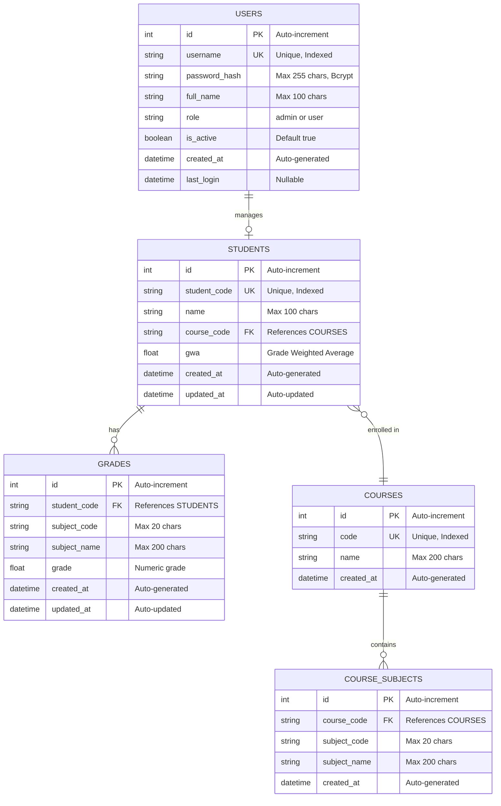

# EduCore Database - Entity Relationship Diagram (ERD)

## Database Schema Overview
**Database Name:** `educore_db`  
**RDBMS:** MySQL  
**ORM:** SQLAlchemy 2.0.36

---

## Entity Relationship Diagram



---

## Relationships Explained

### 1. **STUDENTS → COURSES** (Many-to-One)
- **Relationship:** Each student is enrolled in ONE course
- **Foreign Key:** `students.course_code` → `courses.code`
- **Cascade:** On course deletion, students remain (nullable FK)
- **Example:** Student "John Doe" is enrolled in "BSCS" course

### 2. **STUDENTS → GRADES** (One-to-Many)
- **Relationship:** One student can have MANY grades
- **Foreign Key:** `grades.student_code` → `students.student_code`
- **Cascade:** DELETE CASCADE - deleting a student removes all their grades
- **Constraint:** Unique combination of (`student_code`, `subject_code`)
- **Example:** Student "24-49051" has grades in multiple subjects

### 3. **COURSES → COURSE_SUBJECTS** (One-to-Many)
- **Relationship:** One course contains MANY subjects
- **Foreign Key:** `course_subjects.course_code` → `courses.code`
- **Cascade:** DELETE CASCADE - deleting a course removes all its subjects
- **Constraint:** Unique combination of (`course_code`, `subject_code`)
- **Example:** "BSCS" course includes subjects like "OOP", "Data Structures"

### 4. **USERS → STUDENTS** (One-to-Many - Implicit)
- **Relationship:** Users (admins) manage student records
- **No Direct FK:** Managed through application logic
- **Authentication:** Required to access student data
- **Example:** Admin user manages all student records

---

## Constraints & Indexes

### Primary Keys
- All tables have auto-incrementing `id` as primary key

### Unique Constraints
| Table | Unique Columns | Constraint Name |
|-------|---------------|-----------------|
| `students` | `student_code` | Automatic UK |
| `courses` | `code` | Automatic UK |
| `users` | `username` | Automatic UK |
| `course_subjects` | `course_code`, `subject_code` | `uq_course_subject` |
| `grades` | `student_code`, `subject_code` | `uq_student_subject` |

### Indexes
- `students.student_code` - Indexed for fast QR code lookups
- `courses.code` - Indexed for course queries
- `users.username` - Indexed for login authentication
- All primary keys are automatically indexed

### Foreign Keys
| Child Table | FK Column | Parent Table | Parent Column | On Delete |
|-------------|-----------|--------------|---------------|-----------|
| `students` | `course_code` | `courses` | `code` | NO ACTION |
| `grades` | `student_code` | `students` | `student_code` | CASCADE |
| `course_subjects` | `course_code` | `courses` | `code` | CASCADE |

---

## Data Types & Validation

### String Lengths
- **Student Code:** `VARCHAR(20)` - Format: "YY-XXXXX"
- **Course Code:** `VARCHAR(20)` - Format: "BSCS", "BSIT", etc.
- **Subject Code:** `VARCHAR(20)` - Format: "CS101", "MATH01"
- **Names:** `VARCHAR(100)` - Student/user full names
- **Subject/Course Names:** `VARCHAR(200)` - Descriptive names
- **Username:** `VARCHAR(50)` - Login identifier
- **Password Hash:** `VARCHAR(255)` - Bcrypt hash with salt

### Numeric Fields
- **GWA:** `FLOAT` - Grade Weighted Average (0.0 - 5.0 scale)
- **Grade:** `FLOAT` - Individual subject grades (1.0 - 5.0)

### Timestamps
- **created_at:** Auto-set on record creation (`func.now()`)
- **updated_at:** Auto-updated on record modification
- **last_login:** Nullable, updated on successful authentication

### Boolean Fields
- **is_active:** User account status (default: `TRUE`)

---

## Sample Data Relationships

```
USERS
├── admin (username: "admin", role: "admin")
    └── Manages all students and courses

COURSES
├── BSCS (Bachelor of Science in Computer Science)
│   ├── Students: 24-49051, 24-49052, ...
│   └── Subjects: CS101 (OOP), CS102 (Data Structures), ...
└── BSIT (Bachelor of Science in Information Technology)
    ├── Students: 24-50001, 24-50002, ...
    └── Subjects: IT101 (Programming), IT102 (Networks), ...

STUDENTS
└── 24-49051 (John Doe, BSCS)
    └── GRADES
        ├── CS101 (OOP) - 1.5
        ├── CS102 (Data Structures) - 1.75
        └── MATH01 (Calculus) - 2.0
```

---

## Database Features

### 1. **Authentication & Security**
- Password hashing with Bcrypt (cost factor: 12)
- Role-based access control (admin/user)
- Active account management
- Last login tracking

### 2. **Data Integrity**
- Unique constraints prevent duplicate entries
- Foreign key relationships maintain referential integrity
- Cascade deletions handle dependent records
- Timestamps track record history

### 3. **Performance Optimization**
- Indexed columns for fast lookups (student_code, course_code, username)
- Composite unique constraints for efficient queries
- Auto-incrementing primary keys

### 4. **QR Code Integration**
- Student codes used as QR code identifiers
- Fast student lookup via indexed student_code
- QR codes stored as `{student_code}.png` files

---

## SQL Schema (MySQL)

```sql
-- Create Database
CREATE DATABASE IF NOT EXISTS educore_db;
USE educore_db;

-- Users Table
CREATE TABLE users (
    id INT AUTO_INCREMENT PRIMARY KEY,
    username VARCHAR(50) UNIQUE NOT NULL,
    password_hash VARCHAR(255) NOT NULL,
    full_name VARCHAR(100) NOT NULL,
    role VARCHAR(20) DEFAULT 'user',
    is_active BOOLEAN DEFAULT TRUE,
    created_at TIMESTAMP DEFAULT CURRENT_TIMESTAMP,
    last_login TIMESTAMP NULL,
    INDEX idx_username (username)
);

-- Courses Table
CREATE TABLE courses (
    id INT AUTO_INCREMENT PRIMARY KEY,
    code VARCHAR(20) UNIQUE NOT NULL,
    name VARCHAR(200) NOT NULL,
    created_at TIMESTAMP DEFAULT CURRENT_TIMESTAMP,
    INDEX idx_course_code (code)
);

-- Students Table
CREATE TABLE students (
    id INT AUTO_INCREMENT PRIMARY KEY,
    student_code VARCHAR(20) UNIQUE NOT NULL,
    name VARCHAR(100) NOT NULL,
    course_code VARCHAR(20) NOT NULL,
    gwa FLOAT DEFAULT 0.0,
    created_at TIMESTAMP DEFAULT CURRENT_TIMESTAMP,
    updated_at TIMESTAMP NULL ON UPDATE CURRENT_TIMESTAMP,
    INDEX idx_student_code (student_code),
    FOREIGN KEY (course_code) REFERENCES courses(code)
);

-- Course Subjects Table
CREATE TABLE course_subjects (
    id INT AUTO_INCREMENT PRIMARY KEY,
    course_code VARCHAR(20) NOT NULL,
    subject_code VARCHAR(20) NOT NULL,
    subject_name VARCHAR(200) NOT NULL,
    created_at TIMESTAMP DEFAULT CURRENT_TIMESTAMP,
    FOREIGN KEY (course_code) REFERENCES courses(code) ON DELETE CASCADE,
    CONSTRAINT uq_course_subject UNIQUE (course_code, subject_code)
);

-- Grades Table
CREATE TABLE grades (
    id INT AUTO_INCREMENT PRIMARY KEY,
    student_code VARCHAR(20) NOT NULL,
    subject_code VARCHAR(20) NOT NULL,
    subject_name VARCHAR(200) NOT NULL,
    grade FLOAT NOT NULL,
    created_at TIMESTAMP DEFAULT CURRENT_TIMESTAMP,
    updated_at TIMESTAMP NULL ON UPDATE CURRENT_TIMESTAMP,
    FOREIGN KEY (student_code) REFERENCES students(student_code) ON DELETE CASCADE,
    CONSTRAINT uq_student_subject UNIQUE (student_code, subject_code)
);

-- Insert Default Admin User
INSERT INTO users (username, password_hash, full_name, role) 
VALUES ('admin', '$2b$12$...', 'System Administrator', 'admin');
```

---

## Database Normalization

### Current Normalization Level: **3NF (Third Normal Form)**

✅ **1NF Compliance:**
- All columns contain atomic values
- No repeating groups
- Each table has a primary key

✅ **2NF Compliance:**
- No partial dependencies
- All non-key attributes depend on the entire primary key

✅ **3NF Compliance:**
- No transitive dependencies
- Non-key attributes depend only on the primary key

### Design Rationale:
- **Subject denormalization:** `subject_name` stored in both `course_subjects` and `grades` for query performance
- **Course reference:** Students reference courses by `code` (natural key) instead of `id` for readability
- **Timestamp redundancy:** Both `created_at` and `updated_at` for audit trails

---

## Database Connection

**SQLAlchemy Connection String:**
```python
DATABASE_URL = "mysql+mysqlconnector://root:@localhost:3306/educore_db"
```

**Configuration:**
- Host: `localhost`
- Port: `3306`
- Username: `root`
- Password: *(empty)*
- Database: `educore_db`
- Driver: `mysql-connector-python`

---

*Last Updated: November 18, 2025*
