# Data Flow Diagram Documentation

## System Flow Overview

### System Purpose
The **EduCore Academic Management System** is a comprehensive educational platform designed to streamline academic operations through automated student information management, grade tracking, attendance monitoring, and QR code-based identification. The system provides a modern, user-friendly interface for administrators and teachers to manage student records, courses, grades, and generate analytical reports while ensuring secure authentication and data integrity.

### Architecture Overview
The system follows a **three-tier client-server architecture**:

1. **Presentation Layer (Frontend)**: CustomTkinter-based desktop GUI application providing intuitive interfaces for user interactions, data visualization, and QR code scanning capabilities.

2. **Application Layer (Backend)**: FastAPI-based REST API server handling business logic, data validation, authentication, QR code generation, and analytics processing.

3. **Data Layer (Database)**: MySQL database with SQLAlchemy ORM managing persistent storage of users, students, courses, subjects, and grades with referential integrity.

### Key System Features
- **Secure Authentication System**: Bcrypt-encrypted password storage with role-based access control (admin/user)
- **Student Information Management**: CRUD operations for student records with automatic QR code generation
- **Grade & GWA Tracking**: Real-time grade entry and automatic General Weighted Average (GWA) calculation
- **QR Code Integration**: Automatic generation and camera-based scanning for quick student identification
- **Course Management**: Predefined courses (BSIT, BSCS, BSBA) with associated subjects
- **Analytics & Reports**: Comprehensive reporting with data visualization and performance metrics

---

## Data Flow Diagram

The following diagram illustrates the data flow between external entities, processes, and data stores within the EduCore system.

```mermaid
flowchart TB
    %% External Entities
    Student([👤 Student])
    Admin([👨‍💼 Admin/Teacher])
    
    %% Processes
    P1[1.1 User Authentication<br/>Process]
    P2[1.2 Student Information<br/>Management]
    P3[1.3 Attendance and Grade<br/>Tracking]
    P4[1.4 QR Code<br/>Management]
    P5[1.5 Reports and<br/>Analytics]
    
    %% Data Stores
    D1[(D1: Users Database<br/>Authentication Data)]
    D2[(D2: Student Database<br/>Student Records)]
    D3[(D3: Attendance Database<br/>Grades & GWA)]
    D4[(D4: Course Database<br/>Courses & Subjects)]
    
    %% External Entity to Process Flows
    Admin -->|Login Credentials| P1
    P1 -->|Authentication Status| Admin
    
    Admin -->|Student Information| P2
    P2 -->|Confirmation| Admin
    
    Admin -->|Grade Entry| P3
    P3 -->|Grade Status| Admin
    
    Admin -->|Generate QR Request| P4
    P4 -->|QR Code Image| Admin
    
    Student -->|QR Code Scan| P4
    P4 -->|Student Details| Admin
    
    Admin -->|Report Request| P5
    P5 -->|Analytics & Reports| Admin
    
    %% Process to Data Store Flows
    P1 <-->|User Credentials<br/>Login Records| D1
    
    P2 -->|Store Student Data| D2
    P2 <-->|Retrieve/Update<br/>Student Records| D2
    
    P3 -->|Store Grades| D3
    P3 <-->|Retrieve/Calculate<br/>GWA Data| D3
    
    P4 <-->|Student Code<br/>QR Mapping| D2
    
    P5 <-->|Student Information| D2
    P5 <-->|Grade Records| D3
    P5 <-->|Course Information| D4
    
    P2 <-->|Course Validation| D4
    P3 <-->|Subject Information| D4
    
    %% Inter-Process Data Flows
    P2 -.->|Trigger QR Generation| P4
    P3 -.->|Update GWA| D2
    
    style Student fill:#87CEEB
    style Admin fill:#FFB6C1
    style P1 fill:#90EE90
    style P2 fill:#90EE90
    style P3 fill:#90EE90
    style P4 fill:#90EE90
    style P5 fill:#90EE90
    style D1 fill:#FFD700
    style D2 fill:#FFD700
    style D3 fill:#FFD700
    style D4 fill:#FFD700
```

---

## Process Numbering and Descriptions

### 1.1 User Authentication Process
**Purpose**: Validates user credentials and manages secure access to the system.

**Inputs**:
- Username and password from Admin/Teacher
- User credentials from Users Database (D1)

**Processing**:
- Receives login credentials from frontend GUI
- Queries Users Database to verify username existence
- Compares entered password with stored bcrypt hash
- Validates user active status and role permissions
- Updates last login timestamp upon successful authentication

**Outputs**:
- Authentication success/failure status
- User session data (username, full_name, role)
- Error messages for invalid credentials

**Data Stores Accessed**:
- D1 (Users Database): Read user credentials, write last login timestamp

---

### 1.2 Student Information Management
**Purpose**: Handles complete lifecycle management of student records.

**Inputs**:
- Student details (student_code, name, course_code) from Admin/Teacher
- Course validation data from Course Database (D4)

**Processing**:
- Validates student code uniqueness
- Verifies course code existence against Course Database
- Creates new student record with initial GWA of 0.0
- Updates student course assignments
- Deletes student records and associated grades
- Triggers QR code generation for new students

**Outputs**:
- Student record confirmation
- Updated student information
- QR code generation trigger to Process 1.4

**Data Stores Accessed**:
- D2 (Student Database): Create, read, update, delete student records
- D4 (Course Database): Read course information for validation

---

### 1.3 Attendance and Grade Tracking
**Purpose**: Records and manages student grades with automatic GWA calculation.

**Inputs**:
- Grade data (student_code, subject_code, subject_name, grade) from Admin/Teacher
- Student information from Student Database (D2)
- Subject information from Course Database (D4)

**Processing**:
- Validates student existence in database
- Validates grade range (1.0 to 5.0 scale)
- Checks for existing grade entries (update vs. create)
- Stores new grade or updates existing grade
- Calculates and updates student GWA automatically
- Uses averaging formula: GWA = Σ(grades) / total_subjects

**Outputs**:
- Grade submission confirmation
- Updated GWA value
- Grade status (Excellent, Very Good, Good, Satisfactory, Failed)

**Data Stores Accessed**:
- D2 (Student Database): Read student data, write updated GWA
- D3 (Attendance Database): Create, read, update grade records
- D4 (Course Database): Read subject information for validation

**Grading Scale**:
- 1.0 = Excellent (97-100%)
- 1.25-1.75 = Very Good (90-96%)
- 2.0-2.5 = Good (83-89%)
- 2.75-3.0 = Satisfactory (75-82%)
- 3.0+ = Failed

---

### 1.4 QR Code Management
**Purpose**: Generates and processes QR codes for student identification.

**Inputs**:
- Student code from Process 1.2 (automatic trigger on student creation)
- QR code scan request from Admin/Teacher
- Camera feed for QR code scanning

**Processing**:
- Generates unique QR code image containing student code
- Saves QR code as PNG file in qr_codes directory
- Scans QR codes using camera (OpenCV + pyzbar)
- Decodes QR code data to retrieve student code
- Maps QR code to student record in database

**Outputs**:
- QR code image file (PNG format)
- Student code from scanned QR
- Student details for scanned code

**Data Stores Accessed**:
- D2 (Student Database): Read student information for QR mapping

**Technical Details**:
- QR Code Library: qrcode with error correction level L
- Image Format: PNG, 10x10 box size, 4-unit border
- Scanning: OpenCV camera capture with pyzbar decoder
- Storage: `/qr_codes/{student_code}.png`

---

### 1.5 Reports and Analytics
**Purpose**: Generates comprehensive reports and analytical insights on student performance.

**Inputs**:
- Report request from Admin/Teacher
- Student records from Student Database (D2)
- Grade records from Attendance Database (D3)
- Course information from Course Database (D4)

**Processing**:
- Aggregates student data with GWA calculations
- Generates GWA reports for all students
- Calculates statistics: total students, average GWA, excellent performers
- Creates data visualizations:
  - Student distribution per course (pie chart)
  - Grade distribution across ranges (bar chart)
  - Average GWA per course (bar chart with reference lines)
- Identifies top performers (GWA ≤ 1.75)
- Computes course-wise performance metrics

**Outputs**:
- Comprehensive GWA report with student rankings
- Statistical overview (totals, averages, distributions)
- Visual analytics charts
- Top 10 performers list
- Course performance comparison

**Data Stores Accessed**:
- D2 (Student Database): Read all student records
- D3 (Attendance Database): Read grade records for analysis
- D4 (Course Database): Read course information for grouping

**Report Metrics**:
- Total Students Count
- Overall Average GWA
- Excellent Performers Count (GWA ≤ 1.75)
- Students per Course Distribution
- Grade Range Distribution
- Course-wise Average GWA

---

## Data Stores

### D1: Users Database
**Table**: `users`

**Purpose**: Stores authentication credentials and user profile information for system access control.

**Fields**:
- `id` (Primary Key): Unique user identifier
- `username` (Unique): Login username
- `password_hash`: Bcrypt-encrypted password
- `full_name`: User's complete name
- `role`: Access level (admin/user)
- `is_active`: Account status flag
- `created_at`: Account creation timestamp
- `last_login`: Last successful login timestamp

**Data Flows**:
- **From Process 1.1**: Login credentials for authentication, last login updates
- **To Process 1.1**: Stored user credentials, role information

**Security Features**:
- Passwords stored as bcrypt hashes (never plain text)
- Username uniqueness constraint
- Role-based access control support
- Account deactivation capability

---

### D2: Student Database
**Table**: `students`

**Purpose**: Central repository for student personal information and academic standing.

**Fields**:
- `id` (Primary Key): Unique student record identifier
- `student_code` (Unique): Student identification code (e.g., "24-49051")
- `name`: Student's full name
- `course_code` (Foreign Key): Reference to Course Database
- `gwa`: General Weighted Average (automatically calculated)
- `created_at`: Record creation timestamp
- `updated_at`: Last modification timestamp

**Data Flows**:
- **From Process 1.2**: New student records, course updates
- **From Process 1.3**: Updated GWA values
- **To Process 1.2**: Student information for display/update
- **To Process 1.4**: Student codes for QR generation/lookup
- **To Process 1.5**: Student data for reports

**Relationships**:
- Links to Course Database (D4) via `course_code`
- Links to Attendance Database (D3) via `student_code`

---

### D3: Attendance Database (Grades)
**Table**: `grades`

**Purpose**: Records all grade entries and serves as the basis for GWA calculations.

**Fields**:
- `id` (Primary Key): Unique grade record identifier
- `student_code` (Foreign Key): Reference to Student Database
- `subject_code`: Subject identifier (e.g., "CS 131")
- `subject_name`: Full subject name
- `grade`: Numeric grade (1.0-5.0 scale)
- `created_at`: Grade entry timestamp
- `updated_at`: Grade modification timestamp

**Data Flows**:
- **From Process 1.3**: New grade entries, grade updates
- **To Process 1.3**: Existing grades for updates, GWA calculation
- **To Process 1.5**: Grade data for analytics and reports

**Constraints**:
- Unique constraint on (`student_code`, `subject_code`) - one grade per student per subject
- Grade range validation (1.0 ≤ grade ≤ 5.0)

**Note**: Although named "Attendance Database" in the DFD for alignment with academic documentation standards, this database primarily stores grade information. In the actual implementation, it handles grade tracking and GWA computation.

---

### D4: Course Database
**Tables**: `courses`, `course_subjects`

**Purpose**: Maintains the catalog of available courses and their associated subjects.

**Courses Table Fields**:
- `id` (Primary Key): Unique course identifier
- `code` (Unique): Course code (e.g., "BSIT", "BSCS", "BSBA")
- `name`: Full course name
- `created_at`: Record creation timestamp

**Course Subjects Table Fields**:
- `id` (Primary Key): Unique subject mapping identifier
- `course_code` (Foreign Key): Reference to courses table
- `subject_code`: Subject identifier
- `subject_name`: Full subject name
- `created_at`: Record creation timestamp

**Data Flows**:
- **To Process 1.2**: Course list for student enrollment validation
- **To Process 1.3**: Subject information for grade entry validation
- **To Process 1.5**: Course structure for analytics grouping

**Predefined Courses**:

**BSIT (Bachelor of Science in Information Technology)**:
- CS 131 - Computer Programming 1
- GEd 109 - Purposive Communication
- MATH 111 - Mathematics in the Modern World
- PE 101 - Physical Education 1
- NSTP 101 - National Service Training Program 1
- CS 132 - Computer Programming 2
- GEd 106 - Understanding the Self

**BSCS (Bachelor of Science in Computer Science)**:
- CS 101 - Introduction to Computing
- CS 102 - Fundamentals of Programming
- MATH 101 - Calculus 1
- PHYS 101 - Physics for Computer Science
- ENG 101 - Communication Skills
- CS 201 - Data Structures and Algorithms
- CS 202 - Object-Oriented Programming

**BSBA (Bachelor of Science in Business Administration)**:
- ACCT 101 - Fundamentals of Accounting
- ECON 101 - Microeconomics
- MGT 101 - Principles of Management
- MKT 101 - Principles of Marketing
- FIN 101 - Business Finance

---

## Detailed System Description

### System Architecture and Components

The EduCore Academic Management System is built on a modern, scalable architecture that separates concerns across three distinct layers:

#### 1. Frontend Layer (Presentation)
The graphical user interface is developed using **CustomTkinter**, a modern Python GUI framework that provides:
- **Dark-themed interface** with professional aesthetics
- **Tabbed navigation** for different functional modules (Students, Grades, Reports, Analytics, Courses)
- **Real-time data visualization** using Matplotlib for charts and graphs
- **QR code scanning integration** using OpenCV and pyzbar
- **Responsive design** with scrollable frames and dynamic content

**Key Frontend Modules**:
- `LoginWindow`: Secure authentication interface with credential validation
- `EduCoreApp`: Main application container managing all tabs
- `APIClient`: HTTP client for backend communication
- Specialized tabs for each functional area

#### 2. Backend Layer (Application Logic)
The server-side logic is implemented using **FastAPI**, a modern Python web framework:
- **RESTful API design** with clear endpoint structure
- **Automatic API documentation** via Swagger UI (/docs endpoint)
- **Asynchronous operations** for improved performance
- **Password hashing** using bcrypt for security
- **Data validation** through Pydantic schemas

**API Endpoint Categories**:
- `/api/auth/*` - Authentication and user management
- `/api/students/*` - Student CRUD operations
- `/api/courses/*` - Course and subject information
- `/api/grades/*` - Grade entry and retrieval
- `/api/gwa-report` - GWA report generation
- `/api/analytics/*` - Analytics and statistics

#### 3. Database Layer (Data Persistence)
**MySQL** database with **SQLAlchemy ORM** provides:
- **Relational data model** with foreign key constraints
- **Automatic schema management** via declarative models
- **Connection pooling** for efficient resource utilization
- **Transaction management** ensuring data consistency

### Module Interactions and Workflows

#### User Authentication Workflow
1. User launches the GUI application
2. Login window appears requesting credentials
3. Frontend sends POST request to `/api/auth/login`
4. Backend verifies credentials against Users Database (D1)
5. On success, user session is established
6. Main application window loads with user context
7. Last login timestamp is recorded in database

#### Student Management Workflow
1. Admin enters student information in Students tab
2. Form validates required fields (code, name, course)
3. Frontend sends POST request to `/api/students`
4. Backend validates course code against Course Database (D4)
5. New student record created in Student Database (D2)
6. QR code is automatically generated and saved
7. Confirmation displayed and student list refreshed

#### Grade Entry Workflow
1. Admin enters student code in Grades tab
2. System retrieves student's course from Student Database (D2)
3. Subject list loaded from Course Database (D4) based on course
4. Admin selects subject and enters grade (1.0-5.0)
5. Frontend sends POST request to `/api/grades`
6. Backend validates and stores grade in Attendance Database (D3)
7. GWA is automatically recalculated:
   - System queries all grades for the student
   - Calculates average: GWA = Σ(all grades) / count(grades)
   - Updates student record in Student Database (D2)
8. Confirmation displayed with updated GWA

#### QR Code Generation and Scanning Workflow

**Generation**:
1. Triggered automatically when new student is added
2. Student code is encoded into QR code format
3. QR code image generated using qrcode library
4. Image saved to `/qr_codes/{student_code}.png`
5. Can be viewed via "View QR" button in Students tab

**Scanning**:
1. Admin clicks "Scan QR" button in Grades tab
2. Camera feed opens using OpenCV
3. System continuously scans frames for QR codes
4. When QR code detected, data is decoded using pyzbar
5. Student code extracted and auto-filled in form
6. Student's subjects loaded automatically
7. Admin can immediately enter grade

#### Analytics and Reporting Workflow
1. Admin navigates to Reports or Analytics tab
2. Frontend requests data from respective API endpoints
3. Backend aggregates data from multiple databases:
   - Student information from D2
   - Grade records from D3
   - Course structure from D4
4. Statistical calculations performed:
   - Averages, counts, distributions
   - Top performers identification
   - Course-wise analysis
5. Data returned to frontend
6. Visual charts generated using Matplotlib
7. Interactive reports displayed in GUI

### User Capabilities and System Functionalities

#### Admin/Teacher Capabilities
**Student Management**:
- Add new students with automatic QR code generation
- Update student course assignments
- Delete students and associated records
- View complete student roster with GWA
- Search and filter student records

**Grade Management**:
- Enter grades for any subject (1.0-5.0 scale)
- Update existing grades
- View all grades for a specific student
- Quick lookup via QR code scanning
- Subject auto-loading based on student's course

**Analytics and Reporting**:
- Generate comprehensive GWA reports
- View statistical summaries
- Analyze grade distributions
- Compare course performance
- Identify top performers
- Visualize data through interactive charts

**Course Reference**:
- Browse available courses
- View subjects per course
- Verify course-subject mappings

**QR Code Operations**:
- View QR codes for any student
- Scan QR codes for quick student lookup
- Print QR codes for ID cards

#### System Automation Features
- **Automatic GWA Calculation**: Real-time updates when grades are added/modified
- **Automatic QR Generation**: Creates QR codes immediately upon student addition
- **Data Validation**: Enforces referential integrity and business rules
- **Session Management**: Maintains user context throughout application usage
- **Error Handling**: Comprehensive validation with user-friendly error messages

### Security Features
- **Password Encryption**: Bcrypt hashing with salt
- **Role-Based Access**: Admin and user role differentiation
- **Account Status Control**: Ability to deactivate accounts
- **Session Security**: Token-based authentication
- **Input Validation**: Server-side validation for all inputs
- **SQL Injection Prevention**: ORM parameterized queries

### Technology Stack Summary
- **Frontend**: Python, CustomTkinter, Tkinter, OpenCV, pyzbar
- **Backend**: Python, FastAPI, Uvicorn
- **Database**: MySQL, SQLAlchemy ORM
- **Additional Libraries**: 
  - `bcrypt` - Password hashing
  - `qrcode` - QR code generation
  - `matplotlib` - Data visualization
  - `Pillow` - Image processing
  - `requests` - HTTP client
  - `pydantic` - Data validation

---

## Figure Caption

**Figure 1.1: EduCore Academic Management System - Data Flow Diagram**

This data flow diagram illustrates the complete information flow within the EduCore system, showing interactions between external entities (Students, Admin/Teachers), five core processes (User Authentication, Student Information Management, Grade Tracking, QR Code Management, and Analytics), and four data stores (Users Database, Student Database, Attendance Database, Course Database). The diagram demonstrates how data flows through the system to support academic management operations including secure authentication, student records management, grade tracking with automatic GWA calculation, QR code-based identification, and comprehensive reporting capabilities.

---

## Document Information

**Document Title**: Data Flow Diagram Documentation - EduCore Academic Management System

**Version**: 1.0

**Date**: November 2025

**System Version**: EduCore v2.0

**Purpose**: This document provides comprehensive documentation of the data flow architecture for the EduCore Academic Management System, suitable for academic thesis documentation, technical reference, and system understanding.

---

*End of Data Flow Diagram Documentation*
